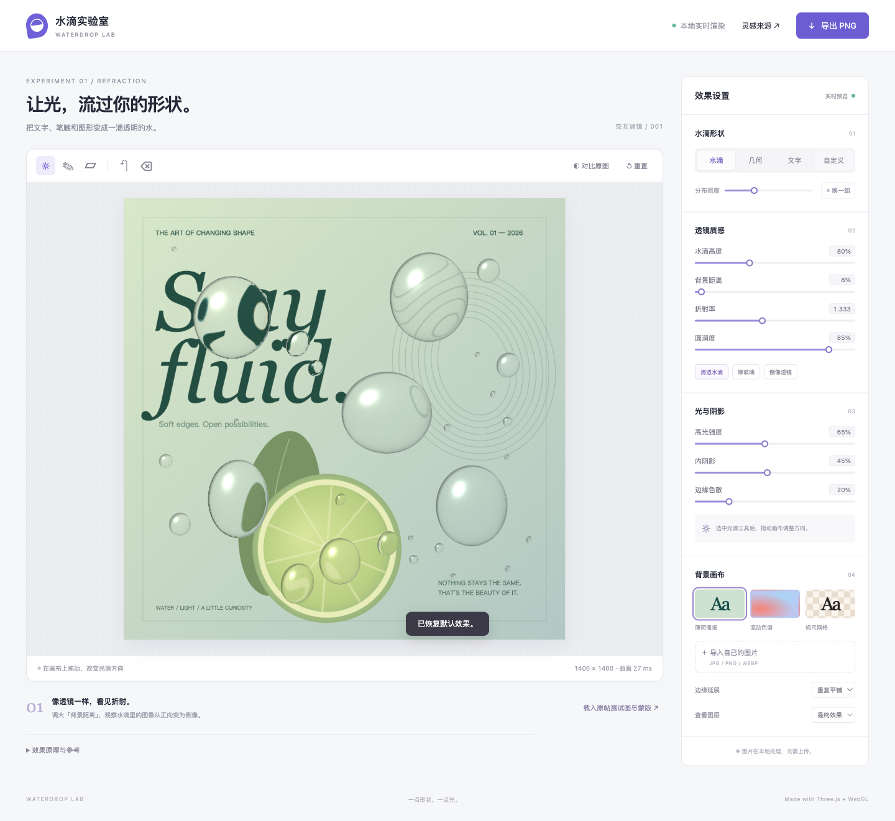

# 水滴实验室 · Waterdrop Lab

一个可运行的 Three.js / WebGL 2 水滴滤镜，参考 [PIXLS.US 原帖](https://discuss.pixls.us/t/recreating-the-ibis-waterdrop-filter-with-gmic/48166) 和 [ibisPaint 官方教程](https://ibispaint.com/lecture/index.jsp?lang=en&no=144)。可将任意蒙版转换为透明透镜，呈现背景扭曲、倒像、可移动高光和内阴影。



[](https://github.com/seasnakes/waterdrop-lab/actions/workflows/ci.yml)

Interactive waterdrop optics for arbitrary masks, text and brush strokes, built with Three.js and WebGL 2.

## 从源码运行

需要 Node.js 22 或更新版本，以及支持 WebGL 2 的浏览器。

```sh
git clone https://github.com/seasnakes/waterdrop-lab.git
cd waterdrop-lab
npm ci
npm run dev
```

打开终端显示的本地地址。默认薄荷海报、色谱和网格均由程序生成，可直接试用。

## 构建与本地预览

```sh
npm run build
npm run preview
```

也可以在构建后用 Python 3 启动 `dist/`：

- macOS：双击 `start.command`，需要 Python 3。
- 其他系统：在本目录运行 `python3 serve.py`，Windows 可使用 `python serve.py`。
- 脚本仅监听 `127.0.0.1`，自动打开浏览器；默认端口被占用时会尝试后续端口。终端按 Ctrl+C 关闭。
- 使用支持 WebGL 2 且启用硬件加速的浏览器。必须通过 HTTP 服务打开，直接双击 `dist/index.html` 的 `file://` 方式无法加载模块与 Worker。

核心渲染、内置示例和图片导入不依赖外部 CDN。图片只在浏览器中处理，刷新会重置；可导出合成 PNG。Git 仓库不包含 `dist/` 或 `node_modules/`。

## 原帖测试素材（可选）

原帖的背景图、透明蒙版和对比图独立下载，未纳入 Git 历史。需要 Python 3：

```sh
npm run fetch:reference
```

下载完成后再启动开发服务或重新构建，即可使用「载入原帖测试图与蒙版」。下载器检查 SHA-256，正常开发和 CI 无需这些文件。详情见 [素材来源说明](public/reference/README.md)。

## 怎么试

1. 默认场景展示清透水滴。拖动画布可以改变光源位置。
2. 点击「几何」或「文字」查看心形、星形、拼接形和任意文字的透明效果。
3. 使用画笔 / 橡皮在画布上编辑，松开后生成曲面。支持撤销与清空。
4. 点击「自定义 → 导入蒙版」。透明 PNG 按 Alpha 读取；不透明黑白图可自动识别，也能手动选择黑色 / 白色为水滴。
5. 导入自己的背景图；当前画布为正方形，背景居中裁切，蒙版按比例完整放入画布。
6. 调节「背景距离」，或选择「倒像透镜」。点击画布下面的「载入原帖测试图与蒙版」可查看原帖素材的强折射效果。
7. 「对比原图」打开可拖动分界。导出始终输出最终效果，不包含界面、对比分界或调试图层。

## 参数

| 参数          | 含义                                                                     |
| ------------- | ------------------------------------------------------------------------ |
| 水滴高度      | 高度场的倍率，80% 对应 0.8 倍；0% 返回原图                               |
| 背景距离      | 平面出射面到背景的距离，以画布宽度为单位，100% = 1 个画布宽度；最大 400% |
| 折射率        | 水滴介质的折射率，默认 1.333，范围 1–1.8                                 |
| 圆润度        | 低值压平中心，高值接近圆顶；所有形状共用同一曲面规则                     |
| 高光 / 内阴影 | 独立调节镜面亮点与轮廓内部的阴影                                         |
| 边缘色散      | 用略有差异的 RGB 折射率产生彩色边缘                                      |
| 边缘延展      | 重复平铺、镜像平铺或边缘拉伸                                             |
| 查看图层      | 合成、蒙版、高度场、法线                                                 |

参数范围是本演示的定义，与 ibisPaint / G’MIC 的数值不能直接一一对应。

## 实现结构

```text
1024² 蒙版
  → Worker 内的平滑高度场（32 → 512 多尺度求解）
  → 曲面梯度 / 法线
  → WebGL 空气到水滴、再到空气的两次折射
  → 背景纹理采样 / 色散
  → 菲涅耳反射 + 高光 + 内阴影
  → 与原图按蒙版合成
```

详细算法、之前的卡点和比较见 [渲染原理与 G’MIC 对比](docs/RENDERING.md)。

高度场在蒙版内部求解 `-Δu = 4`，边界为 0，再取 `sqrt(u)`。对于圆形区域，解析解为 `u = R² − r²`，因此可以得到半球曲面。对任意形状求平滑解，可减少直接使用距离场时在中心骨架处产生的尖脊。求解器在 Worker 中运行，避免阻塞界面。

高度场只在蒙版改变时重建；高度、距离、折射率、圆润度和光源调整全部由着色器完成。画面按需重绘，静止时不持续占用渲染循环。背景使用 Mipmap 与纹理采样器的边界模式，减轻强折射边缘的锯齿。

- `src/engine.js`：独立的 Three.js 渲染封装与导出。
- `src/shaders.js`：折射、法线、照明、内阴影与合成 GLSL。
- `src/height-field.js`：可独立测试的数值求解器。
- `src/height-worker.js`：后台任务与传输封装。
- `src/config.js`：参数定义和预设。
- `src/artwork.js`：演示背景、形状、图像 / 蒙版载入。
- `src/main.js`：交互界面和参数绑定。

这是视觉近似复现，不是 ibisPaint 原始算法，也不是完整三维液体模拟。内阴影和边缘焦散采用艺术近似；全反射采用受限射线近似，不追踪多次内部反弹。复杂形状的局部扭曲、高光位置与原软件仍会有差异。

## 二次开发

Node.js 22 环境已验证。主要依赖版本锁定为 Three.js 0.185.1、Vite 6.4.3。

```sh
npm ci
npm run dev
```

构建：

```sh
npm run build
python3 serve.py
```

可把 `dist/` 作为静态站点部署，已配置相对资源路径。Three.js 的独立依赖包约 504 kB，构建会出现默认 500 kB 阈值的体积提示，不影响运行；gzip 后约 127 kB。

在另一个 Vite / ES module 项目中复用核心（需要同时保留 Worker 与着色器文件）：

```js
import { WaterdropRenderer } from './src/engine.js';

const filter = new WaterdropRenderer(document.querySelector('canvas'));
filter.onReady = () => console.log('曲面已更新');
filter.onError = console.error;
// backgroundCanvas 和 maskCanvas 均为 1024 × 1024。
// 蒙版用不透明黑底 + 白色形状绘制；导入 Alpha 请先转换。
filter.setBackground(backgroundCanvas);
filter.setMask(maskCanvas);
filter.set('uDistance', 0.15);
filter.set('uIor', 1.333);
filter.set('uHeight', 0.8);
filter.setLight(-0.8, 0.85);
// 等待 onReady 后：await filter.exportPNG() 返回 Blob。
// 组件卸载时调用 filter.dispose()。
```

## 开发检查

```sh
npm run format       # 统一 JS、CSS、HTML 和文档格式
npm test             # 曲面数值验证
npm run check        # 格式检查 + 测试 + 生产构建
```

GitHub Actions 在 main 推送和 PR 时运行上述检查，并保存构建产物。CI 不运行 GPU 视觉测试。开发约定见 [CONTRIBUTING.md](CONTRIBUTING.md)。

## 验证和范围

本机 Chromium / WebGL 2 已实际验证参数改变、拖动光源、复杂形状、中文文字、手绘、撤销、原图分界、三类蒙版导入、背景导入、2048² PNG 导出和生产构建 Worker 加载。390 px 宽度页面无横向溢出。未实测所有移动设备、Safari / Firefox 或老旧显卡。

当前画布是固定正方形，背景预处理为 1024²，高度场为 512²；2048² 导出表示输出画布尺寸，并不恢复原图中超过预处理分辨率的细节。非常细的线条可能在蒙版重采样时消失。最大 30 MB / 5000 万像素图片；撤销保留 12 步；没有保存工程、视频输入或液滴流体运动。

## 素材来源

原帖图片的来源、文件名与下载方式见 [public/reference/README.md](public/reference/README.md)，图片权利归原作者。内置薄荷海报、色谱与网格由本项目程序绘制，仓库预览图使用内置海报。

Three.js 为 MIT 许可，全文保留在 [THIRD_PARTY_NOTICES.txt](THIRD_PARTY_NOTICES.txt)。本仓库尚未为原创代码声明独立的开源许可证。
