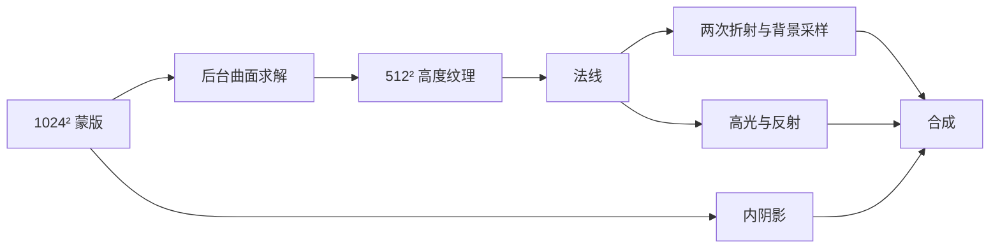

# 渲染原理与 G’MIC 实现对比

本项目使用 2.5D 高度场模拟透明透镜。Three.js 只绘制一个覆盖画布的平面，每个像素的厚度、法线与背景采样坐标由纹理和着色器决定。

## 数据流

## 曲面生成

对二值蒙版内部求解 `-Δu = 4`，在外部和轮廓边界取 `u = 0`，再令基础高度 `h₀ = √u`。

圆形区域的解析解为 `u = R² − r²`，因此基础高度是半球剖面。对于文字、凹形和连通图形，求解同一个方程得到平滑曲面；未连通的区域不会被自动连接，孔洞保持为空。

求解器从 32² 到 512² 逐级细化，在每一级使用红黑 SOR 迭代。粗网格的插值结果作为细网格初值。它是有迭代上限的数值近似，不是所有输入下的精确解；细小线条和窄连接也受重采样分辨率影响。

最后通过 `h = height × cap × tanh(h₀ / cap)` 控制轮廓：较小的 `cap` 压平中心，较大的 `cap` 保留圆顶。界面的圆润度决定 `cap`。边界和光学参数均使用归一化画布坐标，数值不能与 ibisPaint / G’MIC 一一对应。

实现：[`src/height-field.js`](../src/height-field.js)、[`src/height-worker.js`](../src/height-worker.js)。

## 折射与着色

通过高度场中心差分得到梯度，以 `normalize(-∂h/∂x, -∂h/∂y, 1)` 计算法线。从观察方向反向追踪光路：空气进入弯曲上表面，穿过厚度，再从平坦底面返回空气，最后求与背景平面的交点。

这使高度、介质折射率和背景距离具有各自的几何意义。背景距离增大时，采样坐标可能越过光轴，产生倒像。采样器支持重复、镜像和边缘拉伸；Mipmap 用于降低强折射边缘的闪烁和锯齿。

高光使用 Blinn–Phong 项，反射使用 Schlick 菲涅耳近似和程序化环境色。内阴影通过沿光源方向偏移蒙版采样，再裁切回蒙版内部生成。色散对 RGB 使用略有差异的折射率。

实现：[`src/shaders.js`](../src/shaders.js)、[`src/engine.js`](../src/engine.js)。

## 与原帖的区别

以下针对 [PIXLS.US 原帖中的完整脚本](https://discuss.pixls.us/t/recreating-the-ibis-waterdrop-filter-with-gmic/48166)，不是对 G’MIC 所有实现能力的判断。

| 环节     | 原帖脚本                         | 本项目                                   |
| -------- | -------------------------------- | ---------------------------------------- |
| 高度场   | 多次模糊，穿插蒙版裁切，再归一化 | 显式求平滑高度场，再做轮廓压平           |
| 背景扭曲 | 梯度乘强度后作为 `warp` 的位移场 | 法线、厚度、折射率和距离共同确定采样位置 |
| 高光     | 法线通道混合、阈值与归一化       | 观察方向和光源方向参与镜面高光计算       |
| 阴影     | 移位蒙版产生外投影               | 蒙版内部的方向性阴影                     |
| 平铺     | 已通过周期边界实现               | 保留重复平铺，并支持镜像与拉伸           |
| 调参     | 按脚本执行图像处理流程           | 蒙版变化才求解曲面，其余参数复用高度纹理 |

原帖的主要难点是复杂轮廓的曲率难以统一控制：局部平顶、尖角和细颈会影响折射与高光。改进模糊过程可以改善形状，但不能直接保证与目标滤镜一致。

另一个具体限制是原脚本默认 `Specular Centering = 1`，会使高光通道混合中的横向系数 `(1 − centering)` 为零。在这个默认设置下，主高光不受 Light Angle 控制；其他使用该角度的明暗项仍可变化。这与“没有光照命令”是不同的问题。参见 [G’MIC 通道混合说明](https://gmic.eu/reference/mix_channels.html)。

原脚本的 Refraction 主要用作位移强度，没有独立的背景平面距离计算。[G’MIC 的 warp](https://gmic.eu/reference/warp.html) 接受位移场，本身不自动计算透镜光路。

## 性能与局限

- 蒙版修改在 Worker 中处理；高度、距离、折射率和光照变化只触发 GPU 重绘。
- 按需渲染，静止时不持续执行动画循环。尚未完成的蒙版更新只保留最近一个待处理请求。
- 本机样例曲面生成约 27–42 ms，仅为预处理时间；不是完整帧耗时，也不是与 G’MIC 同分辨率、同机器的速度对比。
- 全反射使用受限方向近似，不追踪多次内部反弹；内阴影和边缘焦散也采用艺术近似。
- 当前为固定正方形画布：背景 1024²、高度场 512²、预览 1400²、PNG 输出 2048²。导出尺寸不等于原始纹理细节。
- 这是视觉近似复现，并非 ibisPaint 的原始算法或完整流体模拟。复杂形状的曲率与局部畸变仍可能与原软件不同。

## 数值验证

`npm test` 验证圆形与解析半球的误差、空蒙版、分离液滴、孔洞和非法输入。
圆形测试避开重采样误差最明显的边界，要求中心高度误差和内部 RMSE 小于画布宽度的 0.004（测试半径为 0.2）。

浏览器验收另外检查实际渲染像素变化、光源拖动、手绘与撤销、蒙版导入、对比分界和 PNG 导出。数值测试和 CI 构建成功不能替代跨浏览器视觉验证。
